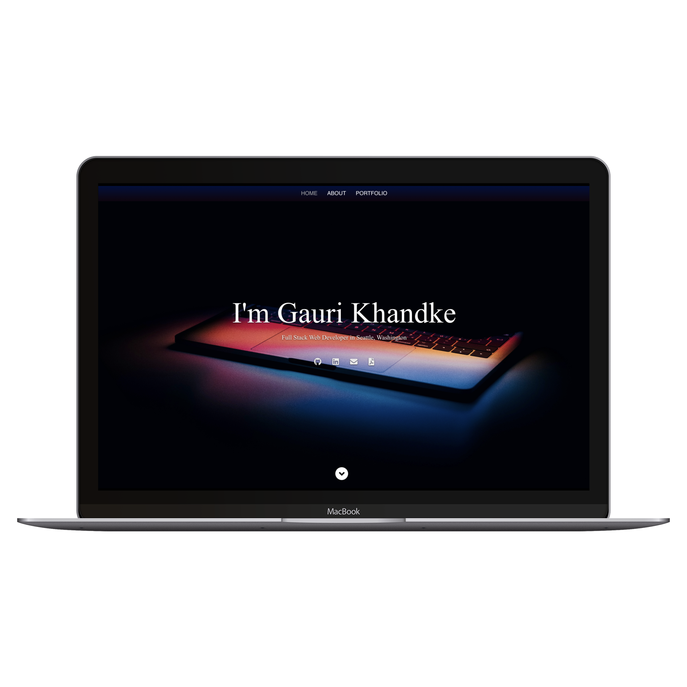
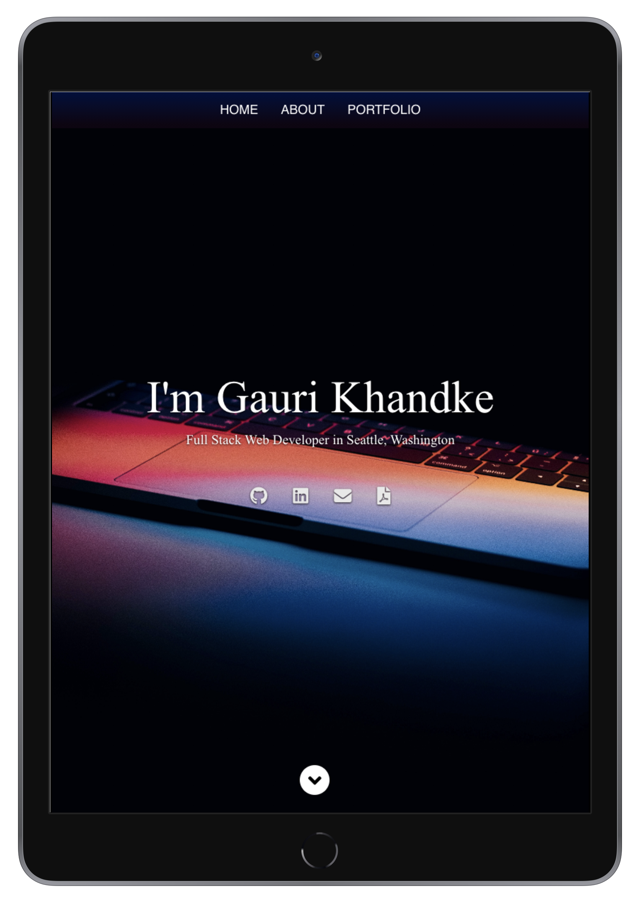
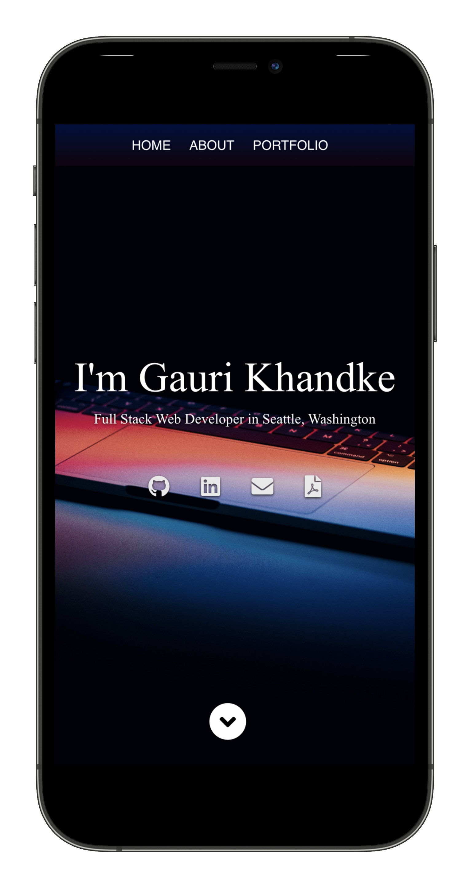

# React Portfolio

# Description

As an Full Stack Web Developer and a member of the dev community, I want to have an portfolio created with the latest technologies to feature a collection of the best projects I have developed so far, So that I can showcase my professional value in a competitive way to employers.

* This portfolio features relevant technologies such as JavaScript, HTML, CSS, SQL / NoSQL Databases, MERN: Mongo, Express, Node, React, and polished UI interfaces.

* Every featured project presents a brief description, icons to see the live application and the Github repository and also details button to show details of the project. 

* The footer includes links to my main internet handles on Github, LinkedIn, my Resume and a link to contact me by email. 

* This portfolio has been created with [React](https://github.com/facebook/create-react-app) and deployed using Github pages.

**Launch the [Portfolio here.](https://gaurikhandke.github.io/react-portfolio/)**  

# Preview : 

#### Landing Page: 

|Medium Devices/ Laptop|Small Devices/ Tablet|Extra Small Devices/Phone
|--|--|--
|||

# Features:

* Polished UI interface.
* Mobile first responsive application across devices.
* React application built using React Router and Components.
* About me presents my introduction.
* Portfolio link featuring 9 projects with a preview image and a description.
* Every project presents icons to launch the app and to see the github repository. Also details button to get each project's details.
* A footer featuring links to my Github, LinkedIn, contact Email and Resume.

# Technology:

* [React](https://github.com/facebook/create-react-app)
* Node js
* Bootstrap
* HTML
* CSS

# Contribution

Please let me know how I can improve this project. Issues and pull requests are always welcome.

# License

This project is licensed under MIT License.

